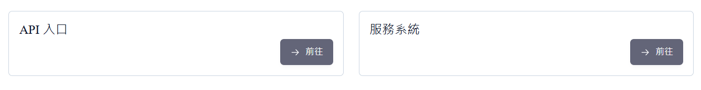
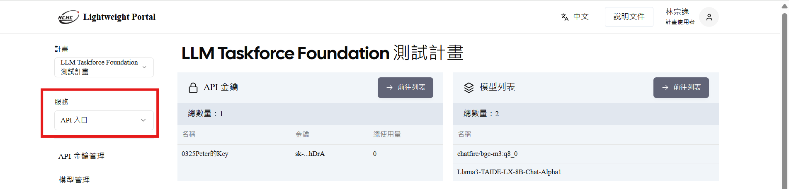
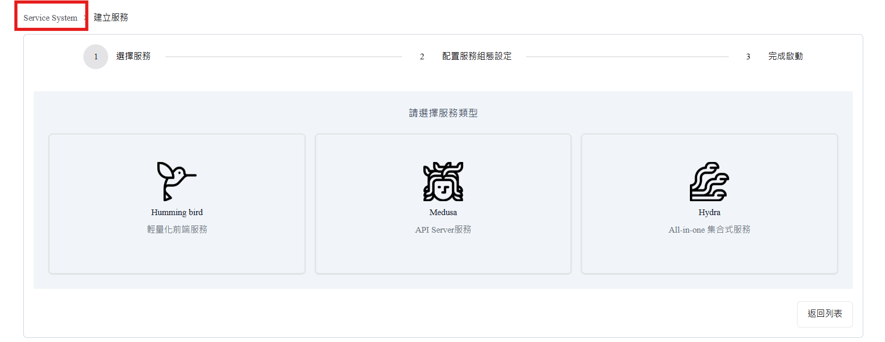
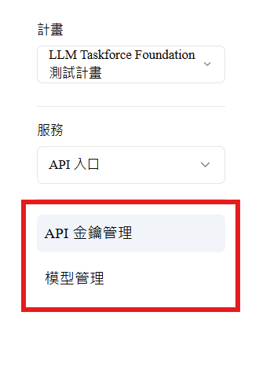
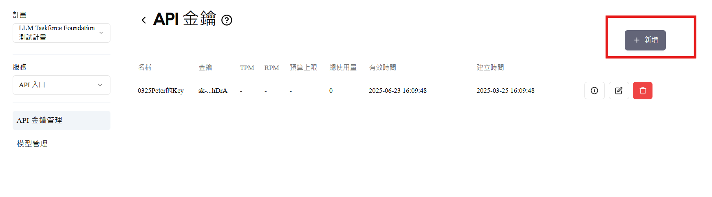
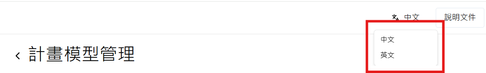

 <h1>平台首頁介紹</h1> 

### 🔖 標誌與平台名稱（左上角）
顯示 **TAIWAN AI RAP** 官方標誌與平台名稱，強化識別度，並可作為快速返回首頁的連結。

### 📌 主選單導航列
以下為主選單各項功能說明：
 

| 項目名稱       | 功能說明 |
|----------------|-----------|
| **特色服務入口** | 提供TAIWAN AI RAP 各項服務介紹與使用服務之入口。 |
| **平台規範**     | 提供平台使用規則與安全守則，包括使用條款暨免責聲明、平台成果授權條款、個人資料使用授權同意書等。 |
| **使用手冊**     | 教學與操作指引，包括帳號申請、服務啟用等，協助用戶快速上手。 |
| **應用成果**     | 展示平台推動下的應用案例、合作開發成果與產出。 |
| **關於我們**     | 介紹平台緣起、負責單位（國研院國網中心）等資訊。 |
| **常見問題**     | 收錄使用過程中常見的技術問題、申請流程等，提供快速自助解答通道。 |
---

### 公告輪播
- 「了解更多」按鈕  
點擊後將導向下方或新頁面，提供更詳細的介紹
---

### 應用成果 Showcase
-  按下【More】按鈕，進入完整應用案例介紹頁  
- 左右箭頭按鈕 `＜ / ＞` 可切換下一則應用成果

---
###  常見問題 FAQ 導覽

-  問題展開清單  
使用者可點擊每個問題項目展開答案內容，說明以簡明扼要方式呈現。  

- 「更多資訊」按鈕  
 點擊後可前往完整 FAQ 頁面或說明文件

###  頁尾 Footer 導覽

- 所有按鈕皆可點擊進入對應法規或說明頁

## **服務申請與啟用**
- #### 如何申請帳號

- #### 開通通知

<!--# 客製化流程設計前台/多模型API服務 介面導覽
請選「服務系統」

- 使用服務
- > API服務
 #svcapi
- >Service 服務
 #ss

#### **常見元件說明**
- 頁面內出現的 UI 元件：如表單欄位、下拉選單、結果視覺化區域
- > API服務
 #key_model_red

- 各按鈕、圖示的意義與用途
- >前往列表(API 金鑰、模型列表)
 #gotolist_red
- >新增API 金鑰
 #addkey_red

####  **介面語言**
- 本服務系統介面支援中/英語切換
 #engandzh_red

# 模型微調與評估 介面導覽

#### **平台首頁介紹**
- 首頁畫面截圖
- 各區塊（功能列、輪播、公告區、快捷連結）說明
- 如何快速進入核心服務

#### **主選單 / 導航列介紹**
- 介紹平台主選單或側邊欄的分類與功能

常見頁面：
查看說明文件：請至官方網站「使用手冊/核心功能介紹/模型微調與評估」，或可以至Docs／rhap-press專案下查看

我的服務、API文件、模型設定、使用記錄、帳號設定等

#### **使用者控制區**
- 登入後的操作區域介紹
- 如何查看帳號資訊、使用紀錄、通知訊息等

#### **服務申請與啟用**
- 如何申請帳號／API Key／使用資源
- 如何啟用一項服務（例如選模型→輸入設定→執行）

#### **核心操作流程圖解**
- 用圖示方式呈現：從註冊 → 開通功能 → 使用服務 → 查看結果
- 或常見任務導引：如「建立問答模型的五步驟」

#### **常見元件說明**
- 頁面內出現的 UI 元件：如表單欄位、下拉選單、結果視覺化區域
- 各按鈕、圖示的意義與用途（例：下載、刪除、重跑、編輯）-->
